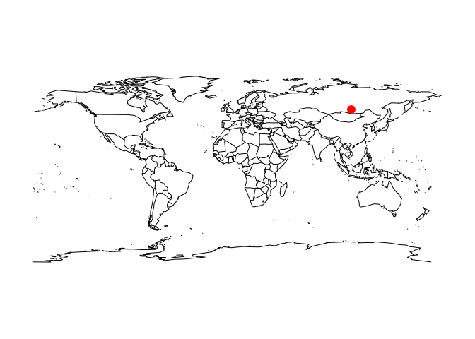

<!-- README.md is generated from README.Rmd. Please edit that file -->
wikilake
========

[](http://www.repostatus.org/#active) [](https://cran.r-project.org/package=wikilake) [](https://travis-ci.org/jsta/wikilake) [](http://cran.r-project.org/web/packages/wikilake/index.html) [](https://github.com/jsta/wikilake)

The `wikilake` package provides functions to scrape the metadata tables from lake pages on Wikipedia.

Installation
------------

`devtools::install_github("jsta/wikilake")`

Usage
-----

``` r
library(wikilake)
#> Loading required package: maps
```

``` r
# metadata only
lake_wiki("Lake Mendota")
#> Retrieving data from: https://en.wikipedia.org/wiki/Lake_Mendota
#>           Name                             Location Primary inflows
#> 1 Lake Mendota Dane County, Wisconsin,United States    Yahara River
#>   Primary outflows      Catchment area Basin countries
#> 1     Yahara River 562 km2 (217 sq mi)   United States
#>                           Surface area Max. depth Residence time
#> 1 9,740 acres (3,940 ha) (39.4 sq. km)         25      4.5 years
#>       Shore length1 Surface elevation                              Frozen
#> 1 21.6 mi (34.8 km)    259 m (850 ft) December 20 (average freezing date)
#>       Lat      Lon
#> 1 43.1066 -89.4247
```

``` r
# metadata + map
lake_wiki("Gull Lake (Michigan)", map = TRUE)
#> Retrieving data from: https://en.wikipedia.org/wiki/Gull_Lake_(Michigan)
```



    #>        Name                                            Location
    #> 1 Gull Lake Kalamazoo / Barry counties, Michigan, United States
    #>   Basin countries        Surface area Max. depth   Surface elevation
    #> 1   United States 2,030 acres (8 km2)         34 879 feet (268 m)[1]
    #>      Lat     Lon
    #> 1 42.399 -85.411

``` r
lake_wiki("Gull Lake (Michigan)", map = TRUE, "usa")
#> Retrieving data from: https://en.wikipedia.org/wiki/Gull_Lake_(Michigan)
```


    #>        Name                                            Location
    #> 1 Gull Lake Kalamazoo / Barry counties, Michigan, United States
    #>   Basin countries        Surface area Max. depth   Surface elevation
    #> 1   United States 2,030 acres (8 km2)         34 879 feet (268 m)[1]
    #>      Lat     Lon
    #> 1 42.399 -85.411

``` r
lake_wiki("Lake Nipigon", map = TRUE, regions = "Canada")
#> Retrieving data from: https://en.wikipedia.org/wiki/Lake_Nipigon
```


    #>           Name Location Primary outflows              Catchment area
    #> 1 Lake Nipigon  Ontario    Nipigon River 25,400 km2 (9,800 sq mi)[1]
    #>   Basin countries            Surface area Average depth Max. depth
    #> 1          Canada 4,848 km2 (1,872 sq mi)          <NA>       <NA>
    #>              Water volume Shore length1 Surface elevation   Lat   Lon
    #> 1 248 km3 (59.5 cu mi)[2]   1044 km [2]    260 m (850 ft) 49.83 -88.5

``` r
lake_wiki("Cass Lake (Michigan)", map = TRUE, "state", region = "Michigan")
#> Retrieving data from: https://en.wikipedia.org/wiki/Cass_Lake_(Michigan)
```


    #>        Name                 Location Basin countries         Surface area
    #> 1 Cass Lake Oakland County, Michigan   United States 1,280 acres (520 ha)
    #>   Max. depth   Surface elevation    Lat     Lon
    #> 1         37 928 feet (283 m)[1] 42.606 -83.365
