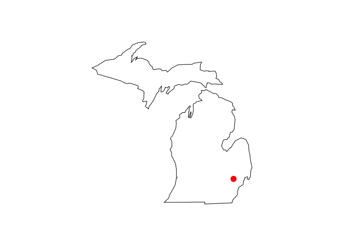

<!-- README.md is generated from README.Rmd. Please edit that file -->
wikilake
========

[](http://www.repostatus.org/#active) [](https://cran.r-project.org/package=wikilake) [](https://travis-ci.org/jsta/wikilake) [](http://cran.r-project.org/web/packages/wikilake/index.html)

The `wikilake` package provides functions to scrape the metadata tables from lake pages on Wikipedia.

Installation
------------

Stable release from CRAN
------------------------

`install.packages("wikilake")`

Development version
-------------------

`devtools::install_github("jsta/wikilake")`

Usage
-----

``` r
library(wikilake)
#> Loading required package: maps
```

``` r
# metadata only
lake_wiki("Lake Mendota")
#> Retrieving data from: https://en.wikipedia.org/wiki/Lake_Mendota
#>           Name                             Location Primary inflows
#> 1 Lake Mendota Dane County, Wisconsin,United States    Yahara River
#>   Primary outflows Catchment area Basin countries Surface area Max. depth
#> 1     Yahara River       562 km^2   United States   9740 acres       25 m
#>   Residence time Shore length1 Surface elevation
#> 1      4.5 years       34.8 km             259 m
#>                                Frozen     Lat      Lon
#> 1 December 20 (average freezing date) 43.1066 -89.4247

# pretty printing metadata
knitr::kable(tidyr::gather(lake_wiki("Lake Mendota")))
#> Retrieving data from: https://en.wikipedia.org/wiki/Lake_Mendota
```

| key               | value                                |
|:------------------|:-------------------------------------|
| Name              | Lake Mendota                         |
| Location          | Dane County, Wisconsin,United States |
| Primary inflows   | Yahara River                         |
| Primary outflows  | Yahara River                         |
| Catchment area    | 562                                  |
| Basin countries   | United States                        |
| Surface area      | 9740                                 |
| Max. depth        | 25                                   |
| Residence time    | 4.5                                  |
| Shore length1     | 34.8                                 |
| Surface elevation | 259                                  |
| Frozen            | December 20 (average freezing date)  |
| Lat               | 43.1066                              |
| Lon               | -89.4247                             |

``` r
# metadata + map
lake_wiki("Gull Lake (Michigan)", map = TRUE)
#> Retrieving data from: https://en.wikipedia.org/wiki/Gull_Lake_(Michigan)
```


    #>        Name                                            Location
    #> 1 Gull Lake Kalamazoo / Barry counties, Michigan, United States
    #>   Primary outflows Basin countries Surface area Max. depth
    #> 1   Gull Creek [1]   United States       8 km^2       34 m
    #>   Surface elevation    Lat     Lon
    #> 1             268 m 42.399 -85.411

``` r
lake_wiki("Gull Lake (Michigan)", map = TRUE, "usa")
#> Retrieving data from: https://en.wikipedia.org/wiki/Gull_Lake_(Michigan)
```


    #>        Name                                            Location
    #> 1 Gull Lake Kalamazoo / Barry counties, Michigan, United States
    #>   Primary outflows Basin countries Surface area Max. depth
    #> 1   Gull Creek [1]   United States       8 km^2       34 m
    #>   Surface elevation    Lat     Lon
    #> 1             268 m 42.399 -85.411

``` r
lake_wiki("Lake Nipigon", map = TRUE, regions = "Canada")
#> Retrieving data from: https://en.wikipedia.org/wiki/Lake_Nipigon
```


    #>           Name Location Primary outflows Catchment area Basin countries
    #> 1 Lake Nipigon  Ontario    Nipigon River     25400 km^2          Canada
    #>   Surface area Average depth Max. depth Water volume Shore length1
    #> 1    4848 km^2        54.9 m      165 m     248 km^3       1044 km
    #>   Surface elevation   Lat   Lon
    #> 1             260 m 49.83 -88.5

``` r
lake_wiki("Cass Lake (Michigan)", map = TRUE, "state", region = "Michigan")
#> Retrieving data from: https://en.wikipedia.org/wiki/Cass_Lake_(Michigan)
```



    #>        Name                 Location Basin countries Surface area
    #> 1 Cass Lake Oakland County, Michigan   United States   1280 acres
    #>   Max. depth Surface elevation    Lat     Lon
    #> 1       37 m             283 m 42.606 -83.365
