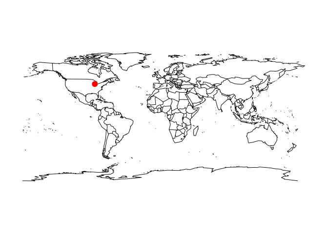
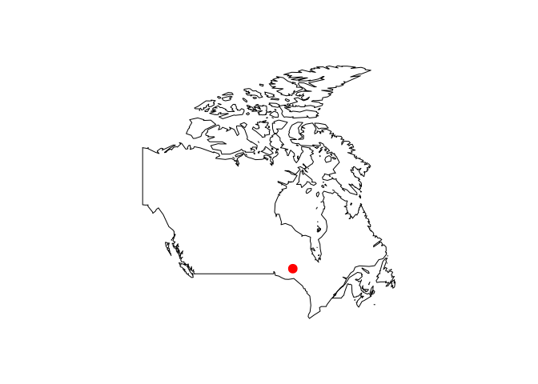

<!-- README.md is generated from README.Rmd. Please edit that file -->

# wikilake

[](https://lifecycle.r-lib.org/articles/stages.html#stable)
[](https://cran.r-project.org/package=wikilake)
[](https://github.com/jsta/wikilake/actions/workflows/tic.yml)
[](https://CRAN.R-project.org/package=wikilake)

The `wikilake` package provides functions to scrape the metadata tables
from lake pages on Wikipedia.

## Installation

## Stable release from CRAN

`install.packages("wikilake")`

## Development version

`devtools::install_github("jsta/wikilake")`

## Usage

``` r
library(wikilake)
#> Loading required package: maps
```

``` r
# metadata only, see units of numeric fields with wikilake::unit_key_()
lake_wiki("Lake Mendota")
#> Retrieving data from: https://en.wikipedia.org/wiki/Lake_Mendota
#>           Name                             Location                    Type
#> 1 Lake Mendota Dane County, Wisconsin,United States Natural freshwater lake
#>   Primary inflows Primary outflows Catchment area Basin countries Max. length
#> 1    Yahara River     Yahara River            562   United States        9.04
#>   Max. width Surface area Average depth Max. depth Water volume Residence time
#> 1       6.61     39.41654          12.8       25.3           NA            4.5
#>   Shore length1 Surface elevation                              Frozen     Lat
#> 1          34.8               259 December 20 (average freezing date) 43.1066
#>        Lon
#> 1 -89.4247
```

``` r
# use the clean = FALSE argument to get raw data
# (i.e. avoid parsing of numeric fields)
lake_wiki("Lake Mendota", clean = FALSE)
#> Retrieving data from: https://en.wikipedia.org/wiki/Lake_Mendota
#>           Name                             Location                    Type
#> 1 Lake Mendota Dane County, Wisconsin,United States Natural freshwater lake
#>   Primary inflows Primary outflows Catchment area Basin countries Max. length
#> 1    Yahara River     Yahara River     562 [km^2]   United States   9.04 [km]
#>   Max. width Surface area Average depth Max. depth             Water volume
#> 1  6.61 [km] 9740 [acres]      12.8 [m]   25.3 [m] 500 million cubic metres
#>   Residence time Shore length1 Surface elevation
#> 1    4.5 [years]     34.8 [km]           259 [m]
#>                                Frozen     Lat      Lon
#> 1 December 20 (average freezing date) 43.1066 -89.4247
```

``` r
# pretty printing metadata
```

| name              | values\_numeric                      | values\_raw                          |
|:------------------|:-------------------------------------|:-------------------------------------|
| Name              | Lake Mendota                         | Lake Mendota                         |
| Location          | Dane County, Wisconsin,United States | Dane County, Wisconsin,United States |
| Type              | Natural freshwater lake              | Natural freshwater lake              |
| Primary inflows   | Yahara River                         | Yahara River                         |
| Primary outflows  | Yahara River                         | Yahara River                         |
| Catchment area    | 562                                  | 562 \[km^2\]                         |
| Basin countries   | United States                        | United States                        |
| Max. length       | 9.04                                 | 9.04 \[km\]                          |
| Max. width        | 6.61                                 | 6.61 \[km\]                          |
| Surface area      | 39.4165392201752                     | 9740 \[acres\]                       |
| Average depth     | 12.8                                 | 12.8 \[m\]                           |
| Max. depth        | 25.3                                 | 25.3 \[m\]                           |
| Water volume      | NA                                   | 500 million cubic metres             |
| Residence time    | 4.5                                  | 4.5 \[years\]                        |
| Shore length1     | 34.8                                 | 34.8 \[km\]                          |
| Surface elevation | 259                                  | 259 \[m\]                            |
| Frozen            | December 20 (average freezing date)  | December 20 (average freezing date)  |
| Lat               | 43.1066                              | 43.1066                              |
| Lon               | -89.4247                             | -89.4247                             |

``` r
# metadata + map
lake_wiki("Gull Lake (Michigan)", map = TRUE)
#> Retrieving data from: https://en.wikipedia.org/wiki/Gull_Lake_(Michigan)
```

<!-- -->

    #>        Name                                            Location
    #> 1 Gull Lake Kalamazoo / Barry counties, Michigan, United States
    #>   Primary outflows Basin countries Surface area Max. depth Surface elevation
    #> 1   Gull Creek [1]   United States            8         34               268
    #>      Lat     Lon
    #> 1 42.399 -85.411

``` r
lake_wiki("Gull Lake (Michigan)", map = TRUE, database = "usa")
#> Retrieving data from: https://en.wikipedia.org/wiki/Gull_Lake_(Michigan)
```

<!-- -->

    #>        Name                                            Location
    #> 1 Gull Lake Kalamazoo / Barry counties, Michigan, United States
    #>   Primary outflows Basin countries Surface area Max. depth Surface elevation
    #> 1   Gull Creek [1]   United States            8         34               268
    #>      Lat     Lon
    #> 1 42.399 -85.411

``` r
lake_wiki("Lake Nipigon", map = TRUE, regions = "Canada")
#> Retrieving data from: https://en.wikipedia.org/wiki/Lake_Nipigon
```

<!-- -->

    #>           Name Location Lake type Primary outflows Catchment area
    #> 1 Lake Nipigon  Ontario   Glacial    Nipigon River          25400
    #>   Basin countries Surface area Average depth Max. depth Water volume
    #> 1          Canada         4848          54.9        165     2.48e+11
    #>   Shore length1 Surface elevation   Lat   Lon
    #> 1          1044               260 49.83 -88.5

``` r
lake_wiki("Cass Lake (Michigan)", map = TRUE, database = "state", regions = "Michigan")
#> Retrieving data from: https://en.wikipedia.org/wiki/Cass_Lake_(Michigan)
```

<!-- -->

    #>        Name                 Location Basin countries Surface area Max. depth
    #> 1 Cass Lake Oakland County, Michigan   United States     5.179997         37
    #>   Surface elevation    Lat     Lon
    #> 1               283 42.606 -83.365
